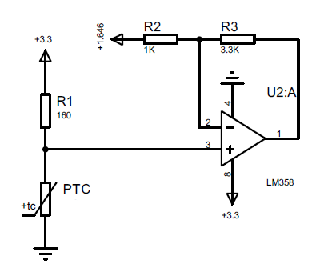

# PT100 Thermistor

<!-- TABLE OF CONTENTS -->
## Table of Contents

* [About the Library](#about-the-project)
* [License](#license)
* [Contact](#contact)


<!-- ABOUT THE Library -->
## About The Library

This library is for PT100 thermistor which is PTC Thermistor. Lookup table is used to correct nonlinearity. It can be applied other PTC thermistors but the lookup table might required to be changed. The function which is used to find the temperature, uses Linear Interpolation method.

* Please not that since the output of the PT100 is small, amplifier circuit might be needed.

* Conversion table can be found [here]().

## Conversion Table

This table and calculations can be found in PT100.odf file.

| Celsius | Ohms   | ADC  |
|---------|--------|------|
| 0       | 100    | 32   |
| 5       | 101.95 | 113  |
| 10      | 103.9  | 192  |
| 15      | 105.85 | 271  |
| 20      | 107.79 | 347  |
| 25      | 109.73 | 423  |
| 30      | 111.67 | 498  |
| 35      | 113.61 | 571  |
| 40      | 115.54 | 643  |
| 45      | 117.47 | 714  |
| 50      | 119.4  | 785  |
| 55      | 121.32 | 853  |
| 60      | 123.24 | 921  |
| 65      | 125.16 | 988  |
| 70      | 127.07 | 1054 |
| 75      | 128.98 | 1119 |
| 80      | 130.89 | 1183 |
| 85      | 132.8  | 1246 |
| 90      | 134.7  | 1308 |
| 95      | 136.6  | 1369 |
| 100     | 138.5  | 1430 |
| 105     | 140.39 | 1489 |
| 110     | 142.29 | 1548 |
| 115     | 144.17 | 1606 |
| 120     | 146.06 | 1663 |
| 125     | 147.94 | 1719 |
| 130     | 149.82 | 1775 |
| 135     | 151.7  | 1829 |
| 140     | 153.58 | 1884 |
| 145     | 155.45 | 1937 |
| 150     | 157.31 | 1989 |
| 155     | 159.18 | 2041 |
| 160     | 161.04 | 2092 |
| 165     | 162.9  | 2143 |
| 170     | 164.76 | 2193 |
| 175     | 166.61 | 2242 |
| 180     | 168.46 | 2291 |
| 185     | 170.31 | 2339 |
| 190     | 172.16 | 2386 |
| 195     | 174    | 2433 |
| 200     | 175.84 | 2479 |
| 205     | 177.68 | 2525 |
| 210     | 179.51 | 2570 |
| 215     | 181.34 | 2614 |
| 220     | 183.17 | 2658 |
| 225     | 184.99 | 2702 |
| 230     | 186.82 | 2745 |
| 235     | 188.63 | 2787 |
| 240     | 190.45 | 2829 |
| 245     | 192.26 | 2870 |
| 250     | 194.07 | 2911 |
| 255     | 195.88 | 2952 |
| 260     | 197.69 | 2992 |
| 265     | 199.49 | 3031 |
| 270     | 201.29 | 3070 |
| 275     | 203.08 | 3109 |
| 280     | 204.88 | 3147 |
| 285     | 206.67 | 3184 |
| 290     | 208.45 | 3222 |
| 295     | 210.24 | 3259 |
| 300     | 212.02 | 3295 |
| 305     | 213.8  | 3331 |
| 310     | 215.57 | 3367 |
| 315     | 217.35 | 3402 |
| 320     | 219.12 | 3437 |
| 325     | 220.88 | 3471 |
| 330     | 222.65 | 3505 |
| 335     | 224.41 | 3539 |
| 340     | 226.17 | 3572 |
| 345     | 227.92 | 3605 |
| 350     | 229.67 | 3638 |
| 355     | 231.42 | 3670 |
| 360     | 233.17 | 3702 |
| 365     | 234.91 | 3734 |
| 370     | 236.65 | 3765 |
| 375     | 238.39 | 3796 |
| 380     | 240.13 | 3827 |
| 385     | 241.86 | 3857 |
| 390     | 243.59 | 3887 |
| 395     | 245.31 | 3917 |
| 400     | 247.04 | 3947 |

## Amplifier circuit

Minimum output voltage is 0.026V and the maximum output voltage is 3.18V.

Reference design and calculations can be found [here](https://www.ti.com/lit/an/sboa322a/sboa322a.pdf?ts=1601451533656&ref_url=https%253A%252F%252Fwww.ti.com%252Ftool%252FCIRCUIT060003).




## Notes

To convert this table with Celsius and ADC columns to array list, this command can be used on terminal:

**Convert .ods file to .csv before running this command***

```Bash
awk -F "\"*,\"*" '{print $2 ", "$7}' *.csv | awk '{print "\{"$0"\}"}' | sed '$!s/$/,/'> Result.txt
```
<!-- LICENSE -->
## License

Distributed under the MIT License. See `LICENSE` for more information.

<!-- CONTACT -->
## Contact

Furkan Yucel - mfurkanycl@gmail.com

Project Link:
